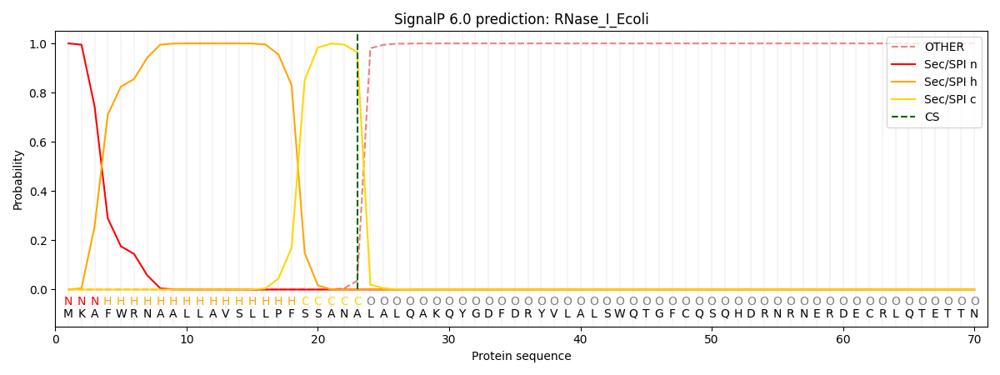

# RNase I Sequence Analysis

A beginner bioinformatics project analyzing the **RNase I gene and protein sequence** from *Escherichia coli* K-12 MG1655 using Python, Biopython, and SignalP-6.0.

## Overview

This project demonstrates a basic computational workflow for analyzing a bacterial gene and its encoded protein. The analysis starts from a DNA sequence, evaluates basic nucleotide characteristics, translates the sequence into a protein sequence, analyzes protein hydrophobicity, and predicts the presence of a signal peptide.

The project was developed as part of my learning journey in **bioinformatics and computational biology**.

## Objectives

* Analyze the nucleotide sequence of the RNase I gene
* Calculate gene length and GC content
* Translate the DNA sequence into its corresponding protein sequence
* Analyze hydrophobic amino acids in the protein
* Predict the presence of a signal peptide
* Interpret the computational results in a biological context

## Tools & Technologies

* **Python**
* **Biopython**
* **Google Colab**
* **SignalP-6.0**

## Analysis Workflow

```text
DNA Sequence
     ↓
Sequence Length
     ↓
GC Content Analysis
     ↓
DNA → Protein Translation
     ↓
Protein Sequence Analysis
     ↓
Hydrophobicity Analysis
     ↓
Signal Peptide Prediction
     ↓
Biological Interpretation
```

## Results

| Analysis                  |         Result |
| ------------------------- | -------------: |
| Gene length               |         807 bp |
| Protein length            |         269 aa |
| GC content                |         51.18% |
| Hydrophobic amino acids   |             19 |
| Hydrophobic percentage    |         63.33% |
| Signal peptide prediction |        Sec/SPI |
| Predicted cleavage site   | Position 23–24 |
| SignalP probability       |       0.964402 |

## Signal Peptide Prediction

SignalP-6.0 predicted a **Sec/SPI signal peptide** at the N-terminus of the RNase I protein.

The predicted cleavage site is located between **positions 23 and 24**, with a prediction probability of **0.964402**.

This prediction suggests that the protein contains an N-terminal signal peptide that may direct it through the **Sec-dependent secretion pathway**.

### SignalP-6.0 Result



The prediction suggests that the protein contains an N-terminal signal peptide that may direct it through the Sec-dependent secretion pathway.

## Interpretation

The analysis identified an 807 bp RNase I gene encoding a 269-amino-acid protein. The nucleotide sequence has a GC content of approximately 51.18%.

Protein sequence analysis identified 19 hydrophobic amino acids, corresponding to approximately 63.33% of the analyzed sequence. SignalP-6.0 predicted a Sec/SPI signal peptide with a cleavage site between positions 23 and 24.

Overall, this project demonstrates a basic computational workflow for analyzing a bacterial gene and its encoded protein using Python, Biopython, and SignalP-6.0.

## Project Structure

```text
rnase-i-sequence-analysis/
│
├── RNase_I_Sequence_Analysis.ipynb
├── README.md
└── .gitattributes
```

## Learning Outcomes

Through this project, I practiced:

* Working with biological sequences in Python
* Using Biopython for sequence analysis
* Calculating basic nucleotide sequence properties
* Translating DNA sequences into protein sequences
* Performing basic protein sequence analysis
* Interpreting signal peptide predictions
* Documenting computational biology workflows using GitHub

## Author

**Fachri Zafawwaz**

Biomedical Engineering — Universitas Gadjah Mada

Interested in **Bioinformatics, Computational Biology, and Biotechnology**.
